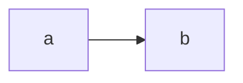

# `profile-prompt`

If the user has not created a profile, it will show the `create-profile` element. If they have, it will show the contents of the default slot for the `profile-prompt` element.

Useful as the top level component of your app, wrapping all the other elements.


## Usage

0. If you haven't already, [go through the setup for the module](/setup).

1. Import the `profile-prompt` element somewhere in the javascript side of your web-app like this:

```js
import '@holochain-open-dev/profiles/dist/elements/profile-prompt.js'
```

2. Use it in the html side of your web-app like this:

```html
<profile-prompt>
  <div slot="hero">
    Welcome to my app! Create a profile to begin.
  </div>
  <div>
    <h1>This is all the other content for my app</h1>
  </div>
</profile-prompt>
```

> [!WARNING]
> Like all the elements in this module, `<profile-prompt>` needs to be placed inside an initialized `<profiles-context>`.



## Demo

Here is an interactive demo of the element:

<element-demo>
</element-demo>

<script setup>
import { onMounted } from 'vue'
import {
  ProfilesZomeMock,
  demoProfiles,
} from "@holochain-open-dev/profiles/dist/mocks.js";
import { ProfilesStore, ProfilesClient } from "@holochain-open-dev/profiles";
import { decodeHashFromBase64 } from '@holochain/client';
import { render, html } from 'lit';

onMounted(async () => {
  // Elements need to be imported on the client side, not the SSR side
  // Reference: https://vitepress.dev/guide/ssr-compat#importing-in-mounted-hook
  await import('@api-viewer/docs/lib/api-docs.js');
  await import('@api-viewer/demo/lib/api-demo.js');
  await import('@holochain-open-dev/profiles/dist/elements/profiles-context.js');
  await import('@holochain-open-dev/profiles/dist/elements/profile-prompt.js');

  demoProfiles().then(profiles => {
    const mock = new ProfilesZomeMock(
      profiles,
      decodeHashFromBase64("uhCAk8OKb2hznzG023xxh_vR3Q7Y4IEOAo4B0QN7ZhbGYeww")
    );
    
    render(html`
  <profiles-context .store=${new ProfilesStore(new ProfilesClient(mock, "lobby"))}>
    <api-demo src="custom-elements.json" only="profile-prompt" exclude-knobs="store">
      <template data-element="profile-prompt" data-target="slot">
        <div slot="hero">Welcome to my app! Create a profile to begin.</div>
        <div>This is where the content for the application should go.</div>
      </template>
    </api-demo>
  </profiles-context>
  `, document.querySelector('element-demo'))
  })

})

</script>

## API Reference

`profile-prompt` is a [custom element](https://web.dev/articles/custom-elements-v1), which means that it can be used in any web app or website. Here is the reference for its API:

<api-docs src="custom-elements.json" only="profile-prompt">
</api-docs>
